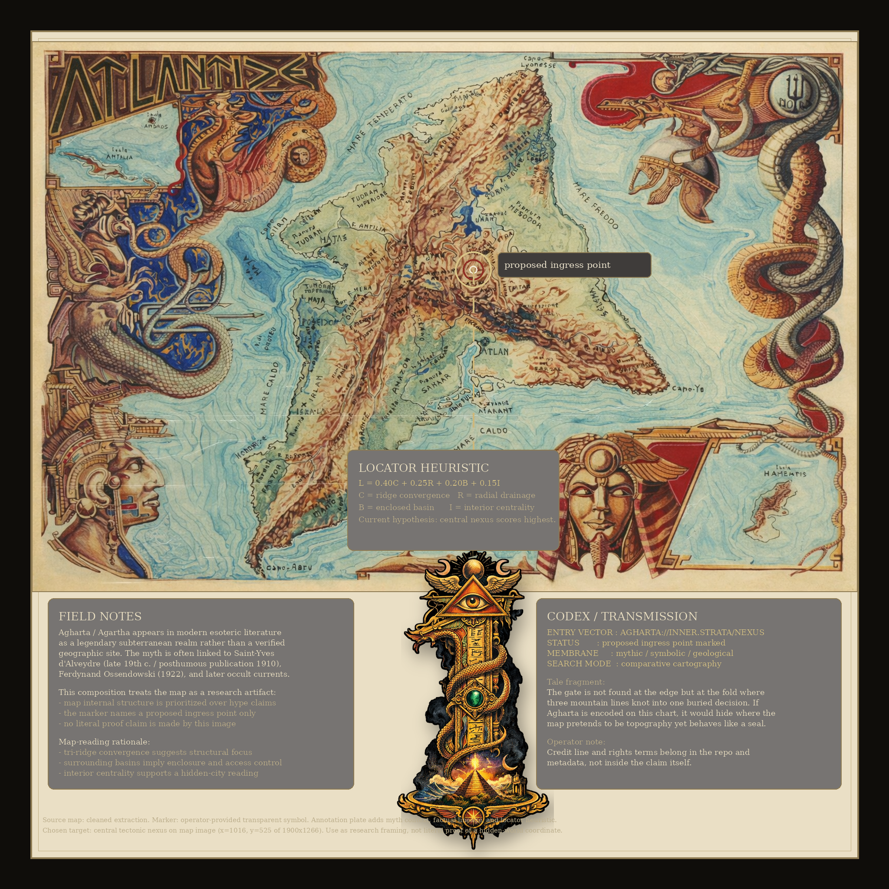

# Agharta

```text
      _    ____ _   _    _    ____ _____  _    
     / \  / ___| | | |  / \  |  _ \_   _|/ \   
    / _ \| |  _| |_| | / _ \ | |_) || | / _ \  
   / ___ \ |_| |  _  |/ ___ \|  _ < | |/ ___ \ 
  /_/   \_\____|_| |_/_/   \_\_| \_\|_/_/   \_\

      SIGNAL TRACE: AI SYSTEMS PROBING THE MYTH OF THE INNER WORLD
      OPERATOR: 3RNESTODDM
      STATUS: PUBLIC RECORD / RESEARCH ARCHIVE
```

Agharta research archive, map studies, myth-engine notes, and rights record for original related materials by:

`Ernesto Duenas Dobrowolski Miroslaw a.k.a. 3rnestoddm`

<p align="center">
  
</p>

<p align="center">
  <em>Current principal artifact: proposed ingress point marked on the active Agharta research map.</em>
</p>

## Mission

This repo is meant to read like a live evidence gate:

- part myth engine
- part research notebook
- part rights registry
- part AI signal archive

The public surface should feel esoteric but sober: maps, transmissions, historical references, coded notes, and documented source trails rather than sales language.

## What this repo is

This repository is the public archive layer for Agharta-related research framing and original materials, including map studies, writing, visual compositions, audiovisual work, metadata, code, and curated releases.

## Orientation

Agharta is treated here as a cross-domain subject:

- esoteric geography
- symbolic cartography
- mythic subterranean civilization narrative
- AI-assisted pattern reading and comparison

This repo does not present a verified scientific discovery. It presents a documented inquiry surface and a body of authored interpretation.

## Investigation Frame

The core working premise of this archive is not that a hidden realm has already been proven, but that some maps, symbols, legends, and narrative systems can be examined as if they preserve fragments of a buried cosmology.

This archive treats the Agharta problem through four synchronized lenses:

- cartographic structure
- mythic narrative continuity
- symbolic encoding
- dimensional or threshold language used to describe transition between worlds

That does not make every claim true. It does make the archive legible as a serious inquiry surface instead of a promo page.

## Synchronization Model

The internal logic used here is:

1. a map may operate as more than geography
2. symbolic overlays may function as access grammar rather than decoration
3. repeated myths of inner realms may encode threshold concepts, not only locations
4. a proposed coordinate on a map can be treated as an ingress hypothesis when geology, centrality, enclosure, and symbolic emphasis converge

In other words, if Agharta is not a simple place in ordinary terrain, the map may still be useful as a synchronization device between:

- physical terrain
- narrative space
- ritual-symbolic space
- imagined or extra-dimensional space

This is a research hypothesis, not a settled proof claim.

## Current Artifact

The main visual artifact in this repo is `AGHARTA_FINAL_RESEARCH_MAP.png`, a composed research plate that:

- uses an extracted source map
- marks one proposed ingress point
- separates factual notes from symbolic transmission language
- treats the marked site as a defensible map-internal hypothesis

For the current reasoning behind that marked point, see `INVESTIGATION_NOTES.md`.

## Agency Layer

This archive can be expanded through a structured agency workflow rather than ad hoc uploads.

See:

- `AGENCY_SYSTEM.md`
- `COMPENDIUM_SCHEMA.md`
- `INDEX.md`
- `compendium/`

## Rights rule

Payment, donation, or NFT purchase alone does **not** transfer exclusive rights.

Exclusive or commercial rights transfer only after:

1. the buyer identifies the exact asset or package
2. the buyer pays the agreed amount
3. `3rnestoddm` accepts in writing
4. `3rnestoddm` issues a signed assignment certificate or written transfer confirmation

Until then, any delivered material is for personal review and evaluation only unless stated otherwise in writing.

For rights, contact, and attribution details, see:

- `NOTICE`
- `TERMS.md`
- `LICENSE`

## Repo contents

- `AGHARTA_FINAL_RESEARCH_MAP.png` - current principal investigation image
- `AGHARTA_FINAL_RESEARCH_MAP.svg` - portable wrapper of the principal image
- `INVESTIGATION_NOTES.md` - serious framing, map logic, and ingress hypothesis notes
- `AGENCY_SYSTEM.md` - multi-agent compendium workflow
- `COMPENDIUM_SCHEMA.md` - stable structure for future archive entries
- `INDEX.md` - top-level navigation
- `SUPPORT_AND_CONTACT.md` - support, contact, and public reference details
- `LICENSE` - custom 3rnestoddm license notice
- `NOTICE` - attribution and contact notice
- `TERMS.md` - public sale and transfer terms
- `PRICE_SCHEDULE.md` - editable discovery-type pricing
- `ASSIGNMENT_CERTIFICATE_TEMPLATE.md` - final transfer template for real buyers

## Archive logic

The archive can hold:

- map extractions
- annotated ingress hypotheses
- visual symbols and locator systems
- source references
- transmissions / tale fragments
- later NFT-linked research artifacts

## Public node

Minimal public references:

- Site: `https://www.runwaypepe.com`
- OpenSea: `https://opensea.io/3rnestoddm`
- Contact: `3rnestoddm@gmail.com`

Detailed contact and support routes are intentionally kept in `SUPPORT_AND_CONTACT.md` and the legal files instead of repeated across the front page.
